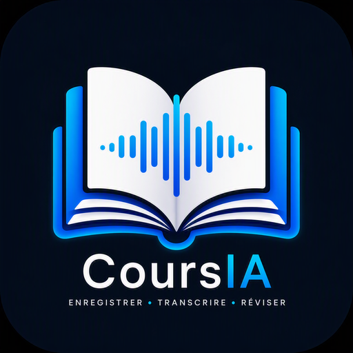

# CoursIA

<p align="center">
  
</p>

<p align="center">
  <strong>Enregistrer · Transcrire · Réviser</strong>
</p>

<p align="center">
  Application de bureau pour transformer un cours audio en retranscription, résumé pédagogique et fiche de révision avec Mistral AI.
</p>

<p align="center">
  <a href="https://github.com/Dofyx/CoursAI">Dépôt GitHub</a>
  ·
  <a href="https://creativecommons.org/licenses/by-nc-sa/4.0/deed.fr">Licence CC BY-NC-SA 4.0</a>
</p>

---

## Présentation

CoursIA est une application de bureau développée en Python avec PySide6. Elle permet d'enregistrer ou d'importer un cours audio, de le retranscrire avec Mistral Voxtral, puis de générer deux documents pédagogiques distincts au format Word :

- un **résumé du cours**, rédigé et structuré pour comprendre le raisonnement général ;
- une **fiche de révision**, synthétique et orientée mémorisation, avec définitions, questions-réponses, mini-quiz et checklist.

Le flux principal est le suivant :

```text
Cours ou fichier audio
        ↓
Enregistrement / import
        ↓
Retranscription Mistral Voxtral
        ↓
Résumé pédagogique ou fiche de révision
        ↓
Document DOCX
```

> CoursIA utilise des services Mistral AI accessibles par API. Une clé API Mistral valide et un compte disposant d'une facturation configurée peuvent être nécessaires selon l'offre utilisée.

---

## Fonctionnalités

### Enregistrement audio

- enregistrement depuis un microphone sélectionnable ;
- pause et reprise de l'enregistrement ;
- nommage automatique à partir de la matière, du titre, de la date et de l'heure ;
- import de fichiers audio existants ;
- gestion des fichiers depuis l'interface : ouverture, renommage et suppression ;
- avertissement avant l'écrasement d'un fichier audio existant.

Formats proposés à l'import par l'application :

- WAV ;
- MP3 ;
- M4A ;
- FLAC ;
- OGG ;
- OPUS.

### Retranscription

- transcription par l'API Mistral avec le modèle `voxtral-mini-latest` par défaut ;
- langue française transmise à l'API ;
- conservation du nom et des métadonnées du cours ;
- création d'un fichier texte UTF-8 ;
- avertissement avant le remplacement d'une retranscription existante.

### Résumé pédagogique

Le résumé est conçu comme un document rédigé permettant de comprendre le cours sans relire toute la retranscription. Il demande notamment à Mistral de produire :

1. l'objet et la problématique du cours ;
2. le plan suivi ;
3. une synthèse développée des idées et raisonnements ;
4. les exemples pédagogiques utiles ;
5. une conclusion avec les points essentiels.

### Fiche de révision

La fiche de révision est volontairement différente du résumé. Elle privilégie une présentation concise et mémorisable comprenant :

1. les objectifs à maîtriser ;
2. les définitions essentielles ;
3. les concepts et mécanismes ;
4. les repères, auteurs, dates ou formules présents dans le cours ;
5. les exemples à retenir ;
6. les erreurs ou confusions à éviter ;
7. des questions-réponses ;
8. un mini-quiz corrigé ;
9. une checklist finale « Je sais… ».

### Sécurité contre les écrasements

CoursIA demande une confirmation avant de remplacer :

- un fichier audio importé ;
- une retranscription TXT ;
- un résumé DOCX ;
- une fiche de révision DOCX.

Le choix **Non** est proposé par défaut afin de limiter les suppressions accidentelles et les appels API inutiles.

---

## Importance du paramétrage des matières

La matière ne sert pas uniquement à classer les fichiers. Elle est enregistrée dans les métadonnées du cours puis ajoutée au contexte envoyé à Mistral lors de la génération du résumé et de la fiche de révision.

Un paramétrage précis aide le modèle à :

- employer le vocabulaire propre à la discipline ;
- interpréter correctement les notions ambiguës ;
- structurer les réponses dans un cadre pédagogique cohérent ;
- produire des définitions et des questions de révision plus pertinentes.

### Matières recommandées

Préférez des intitulés explicites :

```text
Droit constitutionnel
Droit administratif
Droit pénal
Économie générale
Statistiques
Programmation Python
Réseaux informatiques
Cybersécurité
Bases de données
Gestion de projet
```

Évitez les intitulés trop génériques :

```text
Cours
Divers
Test
Matière 1
```

### Configuration

1. Ouvrez la section **Paramètres**.
2. Saisissez une matière par ligne.
3. Enregistrez les paramètres.
4. Sélectionnez ensuite la matière appropriée avant chaque enregistrement ou import.
5. Donnez au cours un titre explicite et spécifique.

---

## Emplacement des fichiers générés

CoursIA crée automatiquement le dossier utilisateur suivant :

```text
~/Documents/CoursIA/
```

Son contenu est organisé ainsi :

```text
~/Documents/CoursIA/
├── config.json
├── Enregistrements/
├── Transcriptions/
├── Documents/
└── Metadonnees/
```

### Enregistrements audio

```text
~/Documents/CoursIA/Enregistrements/
```

Ce dossier contient les enregistrements réalisés dans l'application et les fichiers audio importés.

### Retranscriptions

```text
~/Documents/CoursIA/Transcriptions/
```

Les retranscriptions sont enregistrées au format :

```text
*.txt
```

### Résumés et fiches de révision

```text
~/Documents/CoursIA/Documents/
```

Les documents générés sont nommés selon le type :

```text
*_resume.docx
*_fiche_revision.docx
```

### Métadonnées

```text
~/Documents/CoursIA/Metadonnees/
```

Les fichiers JSON associés conservent notamment :

- la matière ;
- le titre ;
- la date et l'heure ;
- la provenance du contenu.

### Configuration

```text
~/Documents/CoursIA/config.json
```

Ce fichier conserve la liste des matières et les noms des modèles Mistral configurés. Lorsque le trousseau système est disponible, la clé API est confiée à `keyring` plutôt que stockée directement dans le fichier de configuration.

---

## Modèles Mistral

Les valeurs par défaut sont :

```text
Transcription : voxtral-mini-latest
Résumé / fiche : mistral-small-latest
```

Les deux identifiants peuvent être modifiés dans :

```text
Paramètres → Modèles Mistral
```

Une modification incorrecte du nom d'un modèle peut provoquer une erreur retournée par l'API.

---

## Installation du paquet CachyOS / Arch Linux

Le paquet précompilé est publié dans les **Releases** du dépôt GitHub sous un nom proche de :

```text
coursia-0.5-1-x86_64.pkg.tar.zst
```

### Installation

Téléchargez le paquet depuis la release, placez-vous dans le dossier de téléchargement, puis exécutez :

```bash
sudo pacman -U ./coursia-0.5-1-x86_64.pkg.tar.zst
```

### Lancement

Depuis un terminal :

```bash
coursia
```

Ou depuis le menu des applications :

```text
Éducation → CoursIA
```

### Mise à jour

Pour installer une version plus récente téléchargée depuis GitHub :

```bash
sudo pacman -U ./coursia-NOUVELLE_VERSION-x86_64.pkg.tar.zst
```

### Désinstallation

```bash
sudo pacman -Rns coursia
```

Les données créées dans `~/Documents/CoursIA/` ne sont pas supprimées automatiquement par cette commande.

---

## Premier lancement du paquet

Le lanceur du paquet utilise un environnement Python privé dans le profil utilisateur :

```text
~/.local/share/coursia/.venv/
```

Cela évite d'écrire dans `/opt/coursia`, qui appartient à l'administrateur après l'installation par pacman.

Le lanceur doit utiliser une logique équivalente à :

```bash
#!/usr/bin/env bash
set -e

APPDIR="/opt/coursia"
DATADIR="${XDG_DATA_HOME:-$HOME/.local/share}/coursia"
VENV="$DATADIR/.venv"

mkdir -p "$DATADIR"

if [[ ! -x "$VENV/bin/python" ]]; then
    python -m venv "$VENV"
    "$VENV/bin/python" -m pip install --upgrade pip
    "$VENV/bin/python" -m pip install -r "$APPDIR/requirements.txt"
fi

cd "$APPDIR"
exec "$VENV/bin/python" "$APPDIR/main.py"
```

Le fichier `PKGBUILD` doit donc déclarer au minimum les dépendances système suivantes :

```bash
depends=(
    'python'
    'python-pip'
    'portaudio'
)
```

> Le premier lancement peut nécessiter une connexion Internet afin d'installer les dépendances Python définies dans `requirements.txt` dans l'environnement utilisateur.

---

## Installation depuis les sources

### Prérequis sous CachyOS / Arch Linux

```bash
sudo pacman -S --needed python python-pip portaudio
```

### Cloner le dépôt

```bash
git clone https://github.com/Dofyx/CoursAI.git
cd CoursAI/source
```

### Créer l'environnement Python

```bash
python -m venv .venv
source .venv/bin/activate
python -m pip install --upgrade pip
python -m pip install -r requirements.txt
```

### Lancer l'application

```bash
python main.py
```

Le script fourni peut également être utilisé :

```bash
chmod +x run.sh
./run.sh
```

---

## Compilation du paquet `.pkg.tar.zst`

### Construire le paquet

```bash
git clone https://github.com/Dofyx/CoursAI.git
cd CoursAI
```

```bash
makepkg -f
```

Le paquet généré ressemble à :

```text
coursia-0.5-1-x86_64.pkg.tar.zst
```

### Installer le paquet généré

```bash
sudo pacman -U ./coursia-0.5-1-x86_64.pkg.tar.zst
```

Pour compiler et installer en une seule commande :

```bash
makepkg -si
```

---

## Arborescence du dépôt GitHub

Les dossiers de données utilisateur ne sont pas inclus dans le dépôt. Ils sont créés dans `~/Documents/CoursIA/` au premier lancement.

```text
CoursAI/

├── main.py
├── README.md
├── requirements.txt
├── run.sh
└── assets/
    ├── logo.png
    ├── logo.svg
    ├── logo.ico
    ├── logo_16.png
    ├── logo_32.png
    ├── logo_64.png
    ├── logo_128.png
    ├── logo_256.png
    ├── logo_512.png
    ├── logo_icon.png
    ├── logo_icon.ico
    ├── logo_icon_16.png
    ├── logo_icon_32.png
    ├── logo_icon_64.png
    ├── logo_icon_128.png
    └── logo_icon_256.png
```

Le logo affiché en tête de ce README utilise le chemin relatif :

```text
assets/logo.png
```

---

## Conseils d'utilisation

1. Configurez des matières précises avant de créer le premier cours.
2. Donnez à chaque cours un titre explicite.
3. Sélectionnez le bon microphone avant de commencer l'enregistrement.
4. Placez le microphone de façon à limiter les bruits ambiants.
5. Vérifiez la retranscription TXT avant de générer les documents.
6. Utilisez le résumé pour comprendre la progression du cours.
7. Utilisez la fiche de révision pour mémoriser et vous auto-évaluer.
8. Sauvegardez régulièrement le dossier `~/Documents/CoursIA/`.
9. Vérifiez les réponses produites par l'IA avant un usage académique ou professionnel.
10. Ne transmettez pas d'enregistrement confidentiel sans autorisation appropriée.

---

## Cas d'utilisation

CoursIA peut notamment accompagner :

- les études universitaires ;
- les BTS et formations professionnalisantes ;
- les écoles d'ingénieurs ;
- la préparation de concours ;
- la formation continue ;
- l'autoformation ;
- la révision d'examens ;
- la synthèse de conférences ;
- la prise de notes lors de formations techniques ;
- la création d'une base personnelle de cours et de fiches.

---

## Confidentialité et responsabilités

Les fichiers audio, retranscriptions, documents et métadonnées sont enregistrés localement dans le profil utilisateur.

La transcription et la génération de documents impliquent l'envoi des contenus concernés vers l'API Mistral configurée dans l'application.

Avant utilisation, assurez-vous notamment :

- d'être autorisé à enregistrer les personnes présentes ;
- de respecter la confidentialité des échanges ;
- de respecter les règles de votre établissement ;
- de respecter le droit d'auteur et les conditions d'utilisation des contenus ;
- de contrôler les documents produits par l'IA.

CoursIA est un outil d'assistance. Les contenus générés peuvent comporter des erreurs ou des omissions et doivent être vérifiés.

---

## Dépannage

### `Permission denied: /opt/coursia/.venv`

Le lanceur tente de créer l'environnement virtuel dans un répertoire système. Utilisez la version de `coursia.sh` qui crée le venv dans :

```text
~/.local/share/coursia/.venv/
```

### `pip: commande introuvable`

Installez le paquet système :

```bash
sudo pacman -S python-pip
```

### `ModuleNotFoundError`

Supprimez l'environnement utilisateur incomplet puis relancez CoursIA :

```bash
rm -rf ~/.local/share/coursia/.venv
coursia
```

### Le logo ne s'affiche pas dans le README

Vérifiez que le fichier existe réellement dans le dépôt :

```text
assets/logo.png
```

La casse du nom doit être identique. Git distingue `logo.png` de `Logo.png`.

### L'application n'apparaît pas dans le menu

Actualisez la base des applications puis reconnectez-vous à la session si nécessaire :

```bash
update-desktop-database ~/.local/share/applications 2>/dev/null || true
update-desktop-database /usr/share/applications 2>/dev/null || true
```

---

## Contribution

Les contributions sont bienvenues :

1. créez un fork du dépôt ;
2. créez une branche dédiée ;
3. effectuez et testez les modifications ;
4. ouvrez une Pull Request ;
5. utilisez les Issues pour signaler un bug ou proposer une évolution.

Dépôt : [Dofyx/CoursAI](https://github.com/Dofyx/CoursAI)

---

## Licence

CoursIA est présenté sous licence :

```text
CC BY-NC-SA 4.0
```

Creative Commons Attribution - Pas d'Utilisation Commerciale - Partage dans les Mêmes Conditions 4.0 International.

Consultez le [résumé officiel de la licence](https://creativecommons.org/licenses/by-nc-sa/4.0/deed.fr).

---

## Auteur

**Developed by Dofyx**

- Projet : [CoursIA sur GitHub](https://github.com/Dofyx/CoursAI)
- Version décrite : `0.5`

---

## Soutenir le projet

Si CoursIA vous est utile :

- ajoutez une étoile au dépôt ;
- signalez les anomalies dans les Issues ;
- proposez des améliorations ;
- partagez le projet avec les personnes susceptibles d'en avoir besoin.

<p align="center">
  <strong>Bonnes études et bonnes révisions.</strong>
</p>
